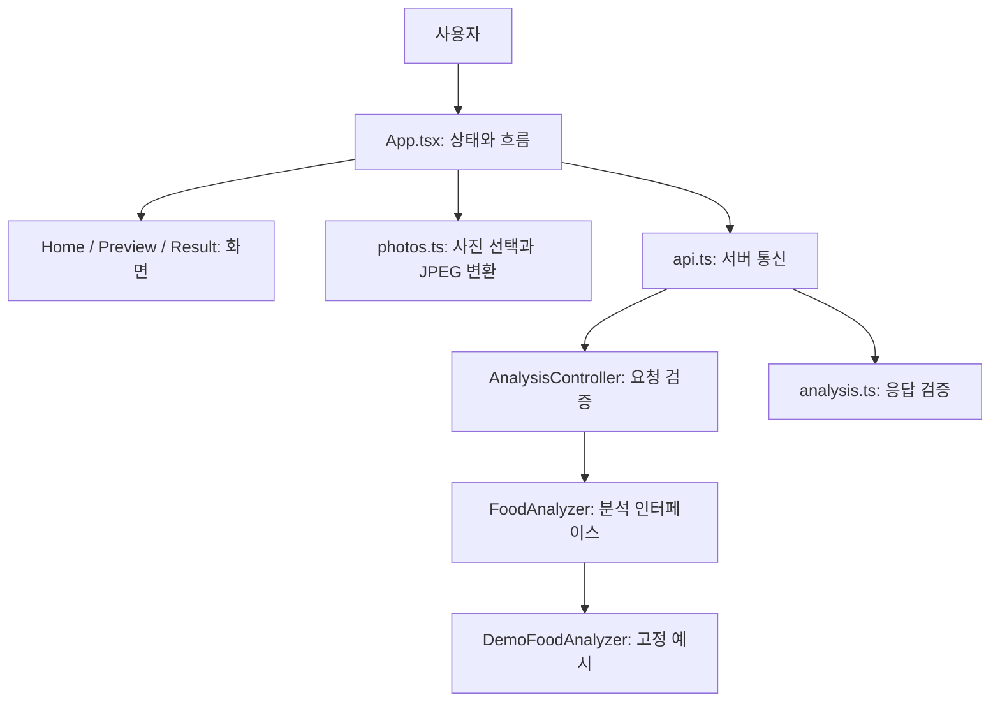

# 기능별 책임과 수정 지도

## 전체 흐름

현재 외부 AI 호출은 없습니다. HTTP 서버와 앱의 전체 연결을 먼저 검증합니다.

## 여러 음식과 디자인 기준

한 장의 사진에 있는 음식을 항목별로 표시하고 서버에서 칼로리를 합산합니다.
앱도 항목 합과 총합이 일치하는지 검증합니다. 현재는 3개 음식으로 구성된 고정 데모입니다.
실제 음식별 인식과 가림·불확실성 처리는 AI 단계에서 구현합니다.
사진 미리보기는 전체를 보여주고, 결과는 총합 카드와 음식별 카드로 구분합니다.
밝은 중립 배경·절제된 녹색·일관된 여백을 사용하고 정보와 버튼의 우선순위를 분명히 합니다.

## 기능별 소유권

| 기능 | 구현 위치 | 맡는 일 | 다른 계층에 맡기는 일 |
| --- | --- | --- | --- |
| 화면 이동 | `mobile/App.tsx` | home → preview → result, 비동기 잠금, 오류 | 네트워크·촬영 구현 |
| 홈 | `mobile/src/screens/HomeScreen.tsx` | 시작 안내, 촬영·앨범 버튼 | 카메라 권한 요청 |
| 사진 확인 | `mobile/src/screens/PreviewScreen.tsx` | 사진과 설명 입력, 전송 이벤트 | 파일 변환·업로드 |
| 결과 | `mobile/src/screens/ResultScreen.tsx` | 총합·범위·항목·데모 표시 | 칼로리 계산·AI 호출 |
| 사진 처리 | `mobile/src/services/photos.ts` | 권한, 선택·취소, 긴 변 1,600px JPEG | 서버 URL·HTTP |
| 앱 통신 | `mobile/src/services/api.ts` | multipart, 30초 제한, 오류, 결과 검증 | 화면 전환·AI 키 |
| 결과 규약 | `mobile/src/types/analysis.ts` | 타입·런타임 검증 | HTTP 요청 |
| 공통 UI | `mobile/src/components/`, `mobile/src/theme.ts` | 버튼·데모 안내·스타일 | 업무 로직 |
| 분석 API | `backend/src/main/java/com/burnkcal/analysis/AnalysisController.java` | 파일·설명 검증, 서비스 호출 | AI 프롬프트·공급자 SDK |
| 분석 | 같은 패키지 `FoodAnalyzer.java`, `DemoFoodAnalyzer.java` | 입력에서 `AnalysisResult` 생성 | HTTP 상태·화면 |
| API 오류 | 같은 패키지 `ApiExceptionHandler.java` | 사용자용 메시지와 HTTP 상태 | 스택 추적 공개 |
| 연결 설정 | `backend/src/main/java/com/burnkcal/config/WebConfig.java`, `backend/src/main/resources/application.properties` | CORS·포트·용량 제한 | UI |
| 서버 상태 | `backend/src/main/java/com/burnkcal/health/HealthController.java` | 상태 확인 | 분석 수행 |

## 상태와 데이터 수명

- 앱 화면 상태는 구분된 TypeScript union으로 관리합니다. 결과 화면에는 반드시 사진과 결과가 있습니다.
- 요청 중 버튼을 잠그고 실패 시 사진·설명을 유지해 다시 요청할 수 있습니다.
- 앱을 종료하면 선택 사진 URI와 결과 상태는 초기화됩니다. 기록 DB는 없습니다.
- 변환 사진은 Expo 캐시에, 요청 파일은 서버의 일시적 멀티파트 처리 영역에 남을 수 있습니다. 영구 사진 저장소는 없습니다.
- 서버는 데모에서 음식 여부를 판별하지 않습니다. 유효한 풍경 사진도 같은 샘플 결과를 반환합니다.

## 확장 방법

실제 AI를 붙일 때는 `FoodAnalyzer`의 구현을 추가하고 구성으로 선택합니다.
응답 형식이 같다면 화면을 다시 만들 필요가 없습니다. 데모 고정 문구·상태 API도 실제 모드에 맞게 함께 갱신합니다.
음식 아님·판별 불가 처리를 추가할 때는 성공처럼 0 kcal를 반환하지 않고 API 규약을 먼저 확장합니다.
화면이 늘어날 때 Router를, 기록이 필요해질 때 저장소를 도입합니다.
